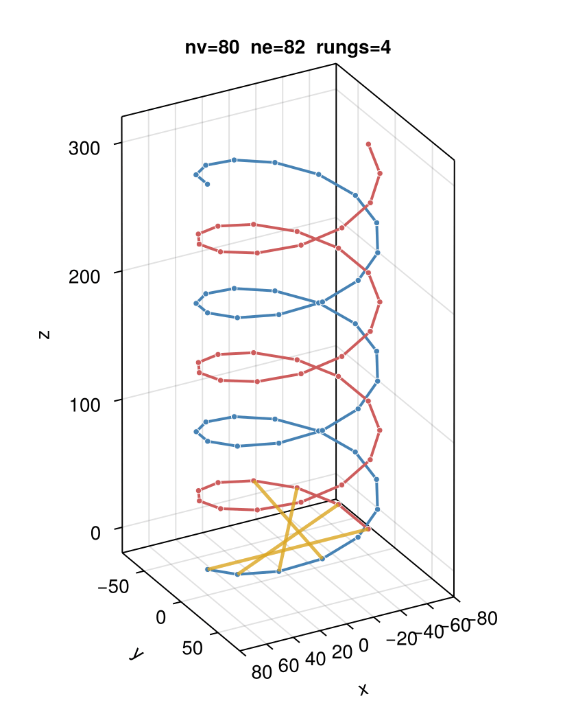
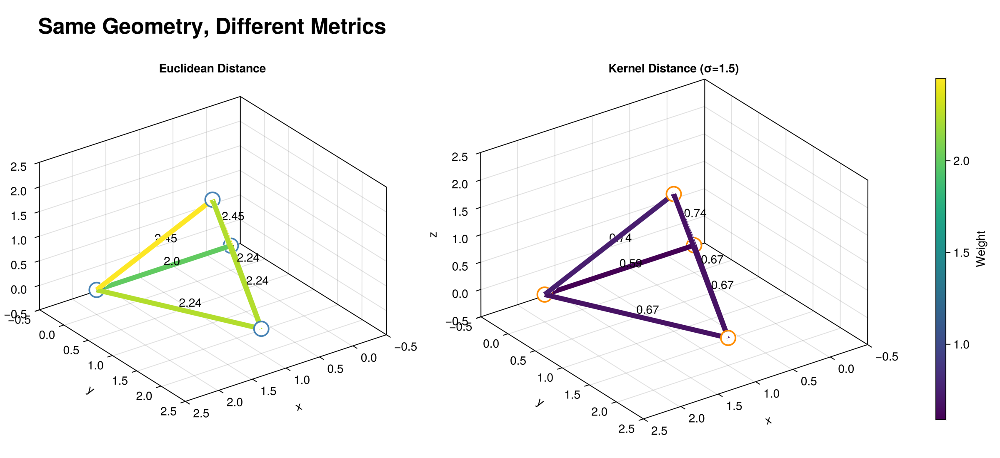

# DynamicGeometricGraphs.jl

[](https://github.com/systems-mechanobiology/DynamicGeometricGraphs.jl/actions/workflows/ci.yml)

DynamicGeometricGraphs.jl provides a dynamic geometric graph data structure that pairs graph topology from the [Graphs.jl](https://github.com/JuliaGraphs/Graphs.jl) ecosystem with N-dimensional vertex coordinates represented using `StaticArrays`. The package is designed for graphs that undergo frequent edits (additions/removals of vertices and edges).



*3D demonstration of dynamic graph operations: A double helix spiral with sampled 2-label vertices (r/b), with dynamic edges between selected spirals.*



*Comparison of edge weights using different distance metrics on the same tetrahedral graph structure. Left: Euclidean distance (L2 norm). Right: Kernel distance (RBF-based). Edge colors and annotations show how the pluggable ambient metric changes edge weights while preserving geometry. Kernel distance compresses long-range edges (e.g., 2.45 → 0.74).*

**Julia Version:** Minimum supported version is Julia 1.11. Older versions may or may not work with dependency updates.

## Why This Package?

DynamicGeometricGraphs.jl is designed for spatial and geometric graphs that require frequent edits (vertex/edge additions and removals). It provides N-dimensional vertex coordinates via StaticArrays, on-the-fly edge weight computation from configurable distance metrics, and efficient dynamic updates using sparse Dict-based storage.

For graphs requiring flexible metadata schemas, consider [MetaGraphs.jl](https://github.com/JuliaGraphs/MetaGraphs.jl), which specializes in arbitrary property storage. This package focuses on fast edits and spatial graphs with fixed numerical metadata.

**Optimized for:**
- Frequent graph edits (streaming/dynamic scenarios)
- Geometric/spatial applications with coordinate-based weights
- Custom distance metrics in geometric spaces
- Memory efficiency (no weight storage, lightweight metadata)

**Not optimized for:**
- Static graphs
- Arbitrary metadata schemas
- Dense graphs

## Features

- **N-dimensional coordinates**: Support for 2D, 3D, or higher dimensional vertex positions
- **Dynamic editing**: Efficient addition and removal of vertices and edges
- **Pluggable ambient metric**: Customize the spatial distance function used to compute edge weights
- **On-the-fly edge weights**: Edge weights computed from coordinates using the ambient metric (no storage overhead)
- **Graphs.jl compatible**: Implements the `AbstractGraph` interface
- **Graph transformations**: Built-in functions for translation, rotation, and scaling
- **Graph generation**: Helper functions for creating hub-spoke and hexagonal patterns

## Usage

### Basic Example

```julia
using Graphs
using StaticArrays
using DynamicGeometricGraphs

# Create a 2D geometric graph with default Euclidean ambient metric
g = DynamicGeometricGraph{2, Float64}()

# Add vertices with coordinates
v1 = Graphs.add_vertex!(g, SVector{2, Float64}(0.0, 0.0))
v2 = Graphs.add_vertex!(g, SVector{2, Float64}(1.0, 0.0))
v3 = Graphs.add_vertex!(g, SVector{2, Float64}(1.0, 1.0))

# Add edges
Graphs.add_edge!(g, v1, v2)
Graphs.add_edge!(g, v2, v3)
Graphs.add_edge!(g, v1, v3)

# Query graph properties
println("Vertices: $(nv(g)), Edges: $(ne(g))")

# Get vertex coordinates
coords = get_vertex_coords(g, v1)  # Returns SVector{2, Float64}(0.0, 0.0)

# Calculate edge weight (computed on-the-fly using ambient metric)
weight = edge_weight(g, v1, v2)  # Returns 1.0
```

### Custom Ambient Metric

The ambient metric can be specified at construction time and optionally overridden at runtime:

```julia
using StaticArrays
using DynamicGeometricGraphs
using Graphs: add_vertex!, add_edge!

# Define a custom Manhattan distance metric
manhattan(a, b) = sum(abs.(a .- b))

# Create graph with Manhattan metric (immutable once set)
g = DynamicGeometricGraph{2, Float64}(distfun=manhattan)

v1 = add_vertex!(g, SVector{2, Float64}(0.0, 0.0))
v2 = add_vertex!(g, SVector{2, Float64}(1.0, 1.0))
add_edge!(g, v1, v2)

# Use the graph's ambient metric (Manhattan)
w1 = edge_weight(g, v1, v2)  # Returns 2.0

# Override with Euclidean for a single call
w2 = edge_weight(g, v1, v2; distancefun=euclid)  # Returns √2 ≈ 1.414

# Note: The ambient metric set at construction is immutable.
# Use the distancefun parameter for runtime overrides on specific calls.
```

### Graph Generation

```julia
using DynamicGeometricGraphs
using Graphs

# Generate a reference graph with hexagonal arrangement
g = refgraph(300.0, 100; pattern=[1,2,3,4,5,6])
println("Generated graph with $(nv(g)) vertices and $(ne(g)) edges")

# Generate a hub-spoke graph
hub_spoke = generate_hub_spoke_graph(50.0, 5)  # 5 spokes
```

### Graph Transformations

```julia
using DynamicGeometricGraphs
using StaticArrays
using Graphs: add_vertex!, add_edge!

g = DynamicGeometricGraph{2, Float64}()
v1 = add_vertex!(g, SVector{2, Float64}(1.0, 0.0))
v2 = add_vertex!(g, SVector{2, Float64}(0.0, 1.0))
add_edge!(g, v1, v2)

# Translate the graph
translation = SVector{2, Float64}(10.0, 5.0)
g_translated = translate_graph(g, translation)

# Scale the graph
g_scaled = scale_graph(g, 2.0)

# Rotate the graph (angle in radians)
g_rotated = rotate_graph(g, π/4)
```

### Visualization (with GLMakie)

```julia
using DynamicGeometricGraphs
using GLMakie

g = refgraph(100.0, 30)
fig, ax = plot_graph(g)
display(fig)
```

## Testing

Once Julia is available in your environment, the package tests can be run with:

```julia
julia --project -e 'using Pkg; Pkg.test()'
```

## Related Packages

- [Graphs.jl](https://github.com/JuliaGraphs/Graphs.jl) - Core graph data structures and algorithms
- [MetaGraphs.jl](https://github.com/JuliaGraphs/MetaGraphs.jl) - Graphs with flexible metadata storage
- [SimpleWeightedGraphs.jl](https://github.com/JuliaGraphs/SimpleWeightedGraphs.jl) - Graphs with stored edge weights
